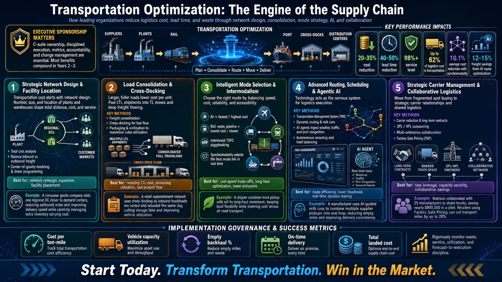

# 🚚 Transportation Optimization: The Engine of the Supply Chain 🌍

> **Reduce logistics cost, shorten lead times, improve service levels, and build a transportation network that compounds competitive advantage over time.**

Transportation optimization is not just about finding cheaper freight rates. It is about designing a smarter, faster, more resilient supply chain that connects suppliers, plants, warehouses, cross-docks, carriers, customers, and real-time data into one coordinated execution system.

A strong transportation strategy helps organizations move from **fragmented, transactional shipping** to a **holistic, demand-driven logistics operating model**.

---

## 🧠 Executive Summary

Transportation is one of the largest cost drivers in logistics. In many supply chains, it can represent up to **62% of total logistics cost**.

To optimize transportation, organizations must execute across five foundational pillars:

1. 🏗️ Strategic Network Design & Facility Location  
2. 📦 Load Consolidation & Cross-Docking  
3. 🚆 Intelligent Mode Selection & Intermodalism  
4. 🤖 Advanced Routing, Scheduling & Agentic AI  
5. 🤝 Strategic Carrier Management & Collaborative Logistics  

When executed with discipline, transportation optimization can deliver:

| 🚀 Impact Area | 📈 Potential Result |
|---|---:|
| 💰 Cost reduction | **20–35%** |
| ⏱️ Lead time reduction | **40–50%** |
| ✅ Service level | **98%+** |
| 🚛 Transportation share of logistics cost | Up to **62%** |
| 🔄 Synchromodality cost reduction | **10.1% average** |
| 🤖 AI route optimization savings | **12–15% freight savings** |

---

## 👑 Executive Sponsorship Matters

Transportation transformation must be owned by senior leadership, not treated as a tactical freight project.

Successful execution requires:

- 👑 **C-suite ownership**
- 📏 Clear metrics
- 🧭 Strategic direction
- 🧑‍🤝‍🧑 Cross-functional accountability
- 🔄 Change management
- 🧱 Long-term capability building

Most benefits compound in **Years 2–3**, so organizations must avoid short-term decisions that weaken long-term logistics capability.

---

# 1️⃣ Strategic Network Design & Facility Location 🏗️📍

> **Transportation cost starts before the truck is loaded. It starts with network design.**

The number, size, and location of plants, warehouses, and distribution centers directly determine:

- 🚛 Distance traveled
- 💸 Transportation cost
- 📦 Inventory levels
- ⏱️ Delivery speed
- ✅ Customer service performance

A poorly designed network creates permanent transportation inefficiency.

## 🔍 Key Methods

### 💰 Total Cost Analysis

Transportation decisions should not be made in isolation.

Organizations must balance:

- Inbound freight cost
- Outbound freight cost
- Inventory carrying cost
- Facility operating cost
- Customer service requirements

For example, adding more regional warehouses may reduce outbound delivery distance, but it can also increase inbound freight complexity and inventory holding cost.

### 📍 Center-of-Gravity Modeling

Center-of-gravity analytics help identify optimal distribution center locations by minimizing total freight movement between supply points and customer markets.

### 🧮 Linear Programming

Linear programming can optimize network decisions under constraints such as capacity, cost, demand, service level, and distance.

## 🌍 Real-World Example

A consumer goods company serves customers across multiple regions from one central warehouse.

By adding a regional distribution center closer to high-demand markets, the company reduces outbound miles, improves delivery speed, and increases customer responsiveness.

However, the company also evaluates the trade-off:

- More inventory locations
- Higher facility cost
- More complex replenishment
- Lower outbound transport cost

✅ Result: a balanced network that improves service without blindly increasing cost.

---

# 2️⃣ Load Consolidation & Cross-Docking 📦🚛

> **Larger, fuller loads reduce cost per unit. Empty space is expensive.**

Transportation economics are driven by scale. Full truckload shipments are usually far more cost-efficient than less-than-truckload shipments because the fixed cost of movement is spread across more volume.

## 🔍 Key Methods

### 🚛 Freight Consolidation

Freight consolidation pools smaller shipments into larger loads.

Instead of sending multiple small LTL shipments, organizations combine freight into full truckload or high-utilization moves.

Benefits include:

- Lower cost per unit
- Better asset utilization
- Fewer shipments
- Reduced handling
- Improved planning visibility

### 🏬 Cross-Docking

Cross-docking keeps freight moving.

Inbound shipments are received, sorted, and quickly transferred to outbound vehicles without long-term storage.

This reduces:

- Warehouse storage cost
- Inventory dwell time
- Handling waste
- Order cycle delays

### 📦 Packaging & Unitization

Better packaging improves cube utilization.

The goal is to maximize:

- Trailer space
- Pallet efficiency
- Load stability
- Payload usage
- Handling efficiency

## 🌍 Real-World Example

A retail replenishment network receives inbound full truckloads from suppliers at a cross-dock.

The goods are sorted by store destination and loaded onto outbound trucks the same day.

✅ Result: lower warehouse storage time, higher vehicle utilization, faster store replenishment, and reduced logistics waste.

---

# 3️⃣ Intelligent Mode Selection & Intermodalism 🚆🚢✈️

> **The best transport mode depends on the trade-off between speed, cost, reliability, and accessibility.**

Not every shipment should move by truck. Not every urgent shipment needs air freight.

Transportation leaders must choose the right mode for the right situation.

## 🚦 Modal Trade-Offs

| Mode | Best For | Trade-Off |
|---|---|---|
| ✈️ Air | High-value, urgent, time-sensitive goods | Fastest but most expensive |
| 🚛 Truck | Flexible regional delivery | Accessible but costlier for long haul |
| 🚆 Rail | Long-distance bulk movement | Lower cost but slower and less flexible |
| 🚢 Water | Heavy international freight | Very low cost but slow |
| 🛢️ Pipeline | Liquids, gas, continuous flow | Low cost but limited product scope |

## 🔍 Key Methods

### 🚆 Intermodal Transportation

Intermodal transportation combines multiple transport modes in one movement.

A common example is:

```text
Truck pickup → Rail long-haul → Truck final delivery
```

This combines the flexibility of trucking with the cost efficiency of rail.

### 🚛 TOFC / Piggybacking

Trailer on Flatcar, also called piggybacking, places truck trailers on railcars for long-haul movement.

This can reduce cost while maintaining local pickup and delivery flexibility.

### 🔄 Synchromodality

Synchromodality dynamically selects the best mode mix in real time based on:

- Cost
- Capacity
- Traffic
- Weather
- Delivery promise
- Resource availability
- Carbon impact

Advanced supply chains can use synchromodal planning to achieve an average cost reduction of **10.1%** while also reducing emissions.

## 🌍 Real-World Example

A shipper moves freight from a factory to customers across the country.

Instead of using trucks for the entire route, the shipper uses trucks for local pickup, rail for the long-haul section, and trucks again for final delivery.

✅ Result: lower cost than all-road transport while preserving local delivery flexibility.

---

# 4️⃣ Advanced Routing, Scheduling & Agentic AI 🤖🗺️

> **Technology is the nervous system of logistics execution.**

Modern transportation optimization depends on real-time data, automation, and intelligent decision-making.

## 🔍 Key Methods

### 🖥️ Transportation Management System — TMS

A modern TMS helps automate:

- Carrier selection
- Rate shopping
- Load matching
- Freight auditing
- Shipment visibility
- Route planning
- Exception management

A strong TMS prevents premium freight traps and supports lowest-cost routing decisions.

### 🗺️ Dynamic Routing

Dynamic routing uses algorithms to optimize vehicle routes based on real-time constraints.

It can reduce:

- Total miles
- Empty backhauls
- Fuel usage
- Driver idle time
- Late deliveries

### 🥛 Milk Runs

Milk runs combine multiple supplier pickups into one scheduled route.

This is especially useful for frequent replenishment and lean supply chains.

### 🤖 Agentic AI & Machine Learning

AI agents can continuously ingest real-time logistics data such as:

- Weather
- Traffic
- Port congestion
- Carrier capacity
- Fuel cost
- Demand signals
- Delivery exceptions

AI-driven route optimization can reduce freight expenses by **12–15%** while improving delivery speed.

## 🌍 Real-World Example

A manufacturer uses AI-guided milk runs to collect parts from multiple suppliers in one optimized loop.

The AI system considers supplier readiness, traffic, truck capacity, and delivery windows.

✅ Result: fewer empty miles, lower fuel cost, better delivery consistency, and improved supplier coordination.

---

# 5️⃣ Strategic Carrier Management & Collaborative Logistics 🤝🚛

> **Transportation procurement must evolve from spot buying to strategic relationship management.**

Fragmented carrier purchasing often leads to higher rates, inconsistent service, and weak capacity access during market disruptions.

Strategic carrier management creates leverage.

## 🔍 Key Methods

### 🤝 Carrier Reduction & Long-Term Contracts

Instead of spreading freight across too many carriers, companies consolidate volume with selected reliable partners.

Benefits include:

- Better rates
- Preferential capacity
- Improved service consistency
- Stronger operational collaboration
- Customized transport solutions

### 🏢 3PL / 4PL Outsourcing

Companies without enough shipping scale can use 3PL or 4PL providers.

These providers pool volume across many customers and negotiate better rates than individual shippers may achieve alone.

### 🔄 Multi-Enterprise Collaboration

Companies can share truck space, warehouse capacity, and transport routes to reduce empty miles.

### 🏭 Factory Gate Pricing — FGP

Factory Gate Pricing allows retailers to buy products at the supplier’s factory gate and manage transportation themselves.

This removes hidden freight markups and gives the retailer more control over consolidation and inbound transport planning.

## 🌍 Real-World Example

Nabisco collaborated with 25 other manufacturers to share trucks and reduce empty miles.

The pilot reportedly saved nearly **$900,000**.

Retailers using Factory Gate Pricing can also cut transport miles by up to **28%** by consolidating inbound flows.

✅ Result: lower cost, fewer empty miles, and stronger collaborative logistics performance.

---

# 📏 Implementation Governance & Success Metrics

Transportation optimization needs disciplined governance.

Track performance using clear operational metrics:

| Metric | Why It Matters |
|---|---|
| 💰 Cost per ton-mile | Measures transport cost efficiency |
| 🚛 Vehicle capacity utilization | Shows how effectively assets are used |
| 🔁 Empty backhaul % | Identifies wasted miles and poor route balance |
| ✅ On-time delivery | Measures service reliability |
| 📦 Total landed cost | Captures full end-to-end supply chain cost |

---

## 🧭 Governance Checklist

Use this checklist to keep execution disciplined:

- ✅ Define executive owner
- ✅ Establish baseline transportation cost
- ✅ Map current network flows
- ✅ Segment lanes by cost, volume, and service criticality
- ✅ Identify LTL-to-TL consolidation opportunities
- ✅ Review mode strategy by lane
- ✅ Implement or improve TMS capability
- ✅ Pilot AI route optimization on high-volume lanes
- ✅ Negotiate strategic carrier contracts
- ✅ Track cost, service, utilization, and empty miles monthly
- ✅ Review benefits over a 2–3 year transformation horizon

---

# 🧩 Transportation Optimization Decision Guide

| Business Situation | Recommended Approach |
|---|---|
| High outbound miles | 🏗️ Network redesign |
| Too many small shipments | 📦 Consolidation |
| High LTL spend | 🚛 Pooling + full truckload conversion |
| Slow warehouse flow | 🏬 Cross-docking |
| Expensive long-haul trucking | 🚆 Intermodal rail + truck |
| Urgent high-value products | ✈️ Air freight, selectively |
| Empty return trips | 🔁 Dynamic routing + backhaul planning |
| Complex supplier pickups | 🥛 Milk runs |
| Carrier rate instability | 🤝 Long-term contracts |
| Limited internal logistics scale | 🏢 3PL / 4PL outsourcing |
| High inbound freight markup | 🏭 Factory Gate Pricing |
| Real-time disruption risk | 🤖 Agentic AI rerouting |

---

# 🏆 Final Takeaway

Transportation optimization is not a single project.

It is a strategic capability built through network design, load consolidation, mode strategy, intelligent routing, carrier collaboration, and disciplined governance.

The best organizations do not only move freight cheaper.

They move freight smarter.

> **Start today. Transform transportation. Win in the market.** 🚀

---

## 🖼️ Suggested Infographic Structure

```text
Suppliers → Plants → Rail / Port → Cross-Dock → Distribution Centers → Customers
                              ↑
                Transportation Optimization Control Tower
                              ↓
       Network Design + Consolidation + Mode Strategy + AI + Collaboration
```

---

## 🚀 Suggested Next Steps

1. 🗺️ Map all major freight lanes and transport spend.
2. 📊 Segment shipments by mode, cost, volume, and service level.
3. 🏗️ Review network design and facility placement.
4. 📦 Identify consolidation and cross-docking opportunities.
5. 🚆 Evaluate intermodal alternatives for long-haul lanes.
6. 🤖 Pilot AI-based routing on complex or high-cost routes.
7. 🤝 Rationalize carrier base and negotiate strategic contracts.
8. 📏 Track cost per ton-mile, capacity utilization, empty backhaul, and on-time delivery.
9. 🔁 Review progress quarterly and compound improvements over Years 2–3.

---